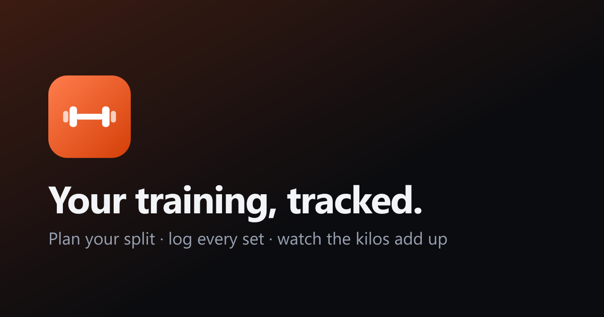

# Gymly

**Live:** https://gymly-ivory.vercel.app

A gym training tracker: build a push / pull / legs split, log every set with the
weight you actually moved, and time the session. Installable as a PWA, works on
any screen size, dark and light.



## What it does

- **Training plan** — days you name and order yourself, each with a focus
  (push, pull, legs, upper, lower, core, cardio, mobility, rest).
- **Categorised exercise picker** — the `+` on a push day offers push movements
  first; 876 exercises with muscles, equipment, difficulty and instructions.
  One tap widens the filter to everything.
- **Session tracking** — press play, adjust the working weight inline, tick each
  exercise off when the sets and reps are done. The row turns green and the
  total load (weight × sets × reps) climbs live in the top bar.
- **Cardio & stretching tab** — conditioning, plyometrics, stretching and foam
  rolling, addable to any day.
- **Account tab** — all-time statistics (volume, streaks, personal records,
  weekly chart, split breakdown), settings, push notification reminders,
  data export, account deletion, and the legal pages.
- **PWA** — home-screen install, app icon, per-device splash screens, offline
  shell, web push.

## Stack

| Layer | Choice |
|---|---|
| Framework | Next.js 16 (App Router, Server Actions) + React 19 |
| Styling | Tailwind CSS v4 with CSS-variable design tokens |
| Database | Turso (libSQL) via Drizzle ORM — a local SQLite file in development |
| Auth | Email + password, scrypt hashes, opaque session cookies (SHA-256 at rest) |
| Push | Web Push with VAPID |
| Hosting | Vercel, with cron jobs for reminders and account purging |

Exercise data comes from
[free-exercise-db](https://github.com/yuhonas/free-exercise-db) (public domain,
Unlicense) and is vendored in `scripts/source-exercises.json`.

## Running locally

```bash
npm install
cp .env.example .env.local     # optional: fill in the push and operator values
npm run vapid:keys             # generates the two Web Push keys
npm run db:migrate             # creates ./local.db
npm run dev
```

With no `TURSO_DATABASE_URL` set, development uses `./local.db`. Production
refuses to start without one, so a missing variable can never silently fall back
to an empty database.

## Environment variables

| Variable | Needed for | Notes |
|---|---|---|
| `TURSO_DATABASE_URL` | production | `libsql://…` connection string |
| `TURSO_AUTH_TOKEN` | production | Turso database token |
| `NEXT_PUBLIC_VAPID_PUBLIC_KEY` | push | from `npm run vapid:keys` |
| `VAPID_PRIVATE_KEY` | push | keep secret |
| `VAPID_SUBJECT` | push | `mailto:` address |
| `CRON_SECRET` | cron | Vercel sends it as a bearer token |
| `NEXT_PUBLIC_SITE_URL` | metadata | canonical origin |
| `NEXT_PUBLIC_OPERATOR_*` | legal pages | `NAME`, `ADDRESS`, `VAT`, `EMAIL` |

Push notifications and the legal operator details are optional: the app detects
their absence and degrades gracefully rather than breaking.

## Scripts

```bash
npm run dev              # development server
npm run build            # production build
npm run db:generate      # regenerate migrations from the Drizzle schema
npm run db:migrate       # apply migrations
npm run catalog:build    # rebuild the exercise catalogue from the source dataset
npm run icons:build      # regenerate icons, splash screens and the OG card
npm run vapid:keys       # mint a Web Push key pair
```

Two check scripts run against a started production build on port 3111:

```bash
node scripts/e2e.mjs     # 46 assertions over the real server actions
node scripts/shots.mjs   # screenshots across phone, tablet, desktop, both themes
```

And one that drives a real browser against a deployment, signing up, training a
session, checking the statistics and deleting the throwaway account again:

```bash
node scripts/prod-check.mjs https://your-deployment.vercel.app
```

## Scheduled jobs

`vercel.json` registers two cron jobs. Both are idempotent and both refuse
requests without the `CRON_SECRET` bearer token.

- `/api/cron/reminders` — sends the training reminders that are due, in each
  user's own timezone, skipping anyone who already trained or was already
  reminded today.
- `/api/cron/purge` — erases accounts whose 14-day deletion grace period has
  elapsed, and drops expired sessions.

## Legal

The Terms, Privacy Policy and Cookie Policy are written against Italian and EU
law (GDPR, Codice Privacy, Codice del Consumo, D.Lgs. 70/2003). They are a
starting template: fill in the `NEXT_PUBLIC_OPERATOR_*` variables and have a
qualified lawyer review them before offering the service publicly. Until the
operator details are set, every legal page shows a visible template notice.
